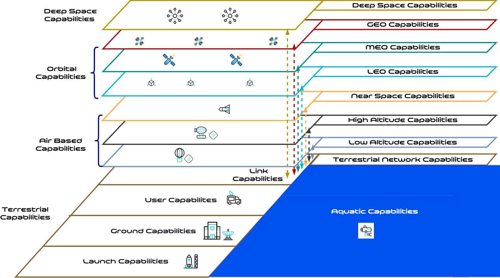

**Space Universal Visualization (sUv): An Overview**

The Space Universal Visualization (sUv) solution will bridge the knowledge gaps between space solutions, engineering, cybersecurity, and resilience. sUv provides universal visual aids in the form of icons and base diagrams. The sUv solution enhances the understanding, aids learning, and facilitates conceptual connections between these domains. Below is a detailed examination of its utility across its intended audiences:

1. **K-12th Graders:**

- **Objective:** To introduce young learners to fundamental space solutions such as segments, satellite components, and associated services.

- **Solution Features:** The sUv provides easily comprehensible universal icons and base diagrams. Even complex space concepts become accessible, fostering a robust foundation for these students. Through these visual aids, students can learn, practice, and refine their visualization skills, paving the way for deeper understanding as they advance in their studies.

2. **University Students:**

- **Objective:** To assist university students, especially those venturing into engineering, in understanding the interplay between space engineering, cybersecurity, and resilience.

- **Solution Features:** The sUv solution presents a curated set of icons and base diagrams for these budding professionals. These visuals function as invaluable aids in simplifying intricate relationships, ensuring students can draw connections between space engineering and its cybersecurity implications.

3. **Cybersecurity Professionals:**

- **Objective:** To enable professionals in the cybersecurity domain, mainly those unfamiliar with space concepts, to understand how methodologies like MITRE ATT&CK and STRIDE threat modeling can be applied in the space context.

- **Solution Features:** sUv provides a universal set of icons and diagrams that elucidate space-related components and their potential vulnerabilities. By understanding these visual aids, cybersecurity professionals can better apply their knowledge to the challenges presented by space technologies, enhancing security and resilience.

4. **Space Professionals:**

- **Objective:** To support space experts with a foundational understanding of cybersecurity and resilience.

- **Solution Features:**  sUv offers universal icons and base diagrams tailored to simplify cybersecurity. By familiarizing themselves with these visuals, space professionals can understand and incorporate cybersecurity measures, ensuring the resilience of their projects and missions. Here are the current icon groups.

	- Platform Asset Group: This group was established and will be maintained by the ethicallyHackingspace (eHs) community to provide a universal visual lexicon for the assets required for commercial space platforms.

	- Platform Security Control Group: This group was established and will be maintained by the ethicallyHackingspace (eHs) community to provide a universal visual lexicon for the primary recommended commercial space platform security controls.
	
	- Platform Compliance Element Group: This group was established and will be maintained by the ethicallyHackingspace (eHs) community to provide a universal visual lexicon for the primary compliance controls supporting commercial space platforms.

	- Platform Vulnerability Group: This group was established and will be maintained by the ethicallyHackingspace (eHs) community to provide a universal visual lexicon for commercial space platform vulnerabilities.

	- Platform Threat Group: 
	
	- SCOR-CMM
	- Stride
	- MITRE ATT&CK
	- MITRE CAPEC
	- Lockheed Martin Cyber Kill Chain
	- The Aerospace Corporation SPARTA
	- ESA SPACE-SHIELD
	- TREKS
	- END USER DEVICE
	- END USER ENVIRONMENT

In conclusion, the Space Universal Visualization (sUv) solution is a tool that recognizes the interconnectedness of space, engineering, and cybersecurity. Providing universal visual aids to different audiences is vital in today's rapidly evolving technological landscape.
